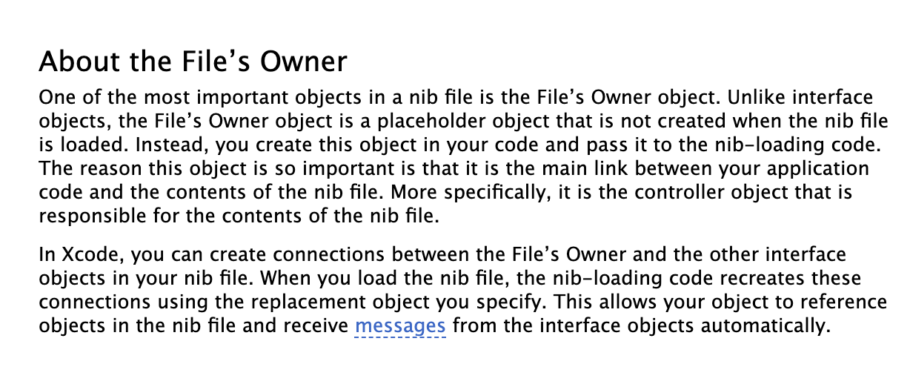

CustomView는 같은 UI를 가지는 View들을 하나의 공통된 View로 묶어 **재사용**하기 위해 만듭니다. **불필요한 코드의 중복을 줄이고 유지보수를 쉽게** 해주기 때문에 저는 되도록 만들어 쓰는 편입니다. CustomView를 만드는 건 이미 많은 블로그에 설명되어 있기 때문에 만드는 방법 보다 `CustomView를 만들면서 생긴 호기심`을 풀어가는 과정에 집중하여 정리하고자 합니다.

내용이 많을 듯하여 나중에 글을 다시 정리할 때는 여러 개의 포스트로 쪼개야 할 것 같습니다ㅠ

시작해보겠습니다.

## CustomView를 만드는 2가지 방법
먼저 CustomView를 만드는 두 개의 방법을 알아보겠습니다.(여기서 IB란 Interface Builder를 말합니다)
> 1. IB에서 File's Owner에 CustomView 클래스를 설정하고 outlet을 연결한다.
2. IB에서 view object에 CustomView 클래스를 설정하고 outlet을 연결한다.

두 개의 방법은 IB에서의 차이점도 있지만 뷰를 초기화하는 코드에도 차이점이 있습니다.
(지금부터는 편의상 CustomView 만드는 방법에 대한 명칭을 1번, 2번으로 지칭하겠습니다.)

1. 1번 방법의 코드
2. 2번 방법의 코드

## Placeholders와 File's Owner
구글링을 했을 때 CustomView를 만들 때 가장 많이 사용하는 방법은 1번 방법이었습니다. Placeholders와 File's Owner가 정확히 무엇인지 모르는 상태에서 한 가지 의문이 생겼습니다.
> 아니, UITableViewCell이나 UICollectionViewCell을 만들면 Interface Builder에 File's Owner가 아니라 Cell Object에 연결되던데 **왜 CustomView는 File's Owner에 연결해서 사용하지?**

이 호기심을 해결하기 위해 먼저 nib 파일의 Placeholders와 File's Owner가 무엇인지 파악해야 할 것 같습니다.

 



 


 

### 1. File's Owner
먼저 [Nib Files](https://developer.apple.com/library/archive/documentation/Cocoa/Conceptual/LoadingResources/CocoaNibs/CocoaNibs.html) 공식 문서에 있는 File's Owner의 내용 중 일부를 나름대로(?) 번역해보겠습니다.

> nib 파일 안의 객체들 중 가장 중요한 것 중 하나가 File's Owner 객체이다. Interface objects와 다르게, File's Owner 객체는 **placeholder 객체**로서 nib 파일이 로드 될 때 생성되지 않는다. 대신, **개발자가 코드 상에서 이 객체를 생성하고 nib-loading code에 전달해야 한다.** 이 객체가 application 코드와 nib 파일의 컨텐츠 사이의 main link로서 너무나도 중요하기 때문이다. **구체적으로 말하자면, File's Owner는 nib 파일의 컨텐츠 들을 책임지는 Controller object다.**
  
Xcode에서 개발자는 nib 파일에서 File's Owner와 다른 interface objects 사이의 connection들을 생성할 수 있다. **nib 파일을 로드 할 때, nib-loading code는 개발자가 명시한 replacement object를 사용해서 이 connection들을 재생성한다.** 이는 객체를 nib 파일 안의 reference objects가 되도록 허용하고, interface objects로 부터 발생한 메시지들을 자동으로 수신하게 해준다.

 

솔직히 모든 내용을 이해하기 어려웠지만(😁), 여기서 유의깊게 봐야할 부분은 File's Owner가 placeholder 객체라는 점인 것 같습니다. 저는 이 placeholder의 의미를 **nib을 소유할 클래스의 타입(인스턴스가 아닌)을 설정하는 것**이라고 이해했습니다. 즉, Interface Builder에서는 타입만을 지정해주고 실제 객체는 코드 상에서 만든 인스턴스를 전달하여 File's Owner로 지정하는 것이죠.

이제 Placeholders와 File's Owner가 무엇인지 대충 감은 잡은 것 같습니다. Placeholders 안에 First Responder도 포함되어 있는데 이 내용은 따로 정리해놓을 예정입니다. 다음은 File's Owner 객체를 어떻게 **전달**하는지 알아봐야겠네요.

 

### 2. loadNibNamed(_:owner:options:)

CustomView를 만들기 위해 구글링을 하면 대부분의 블로그에 이 코드가 포함되어 있습니다. 메인 Bundle에서 "CustomView" 라는 이름을 가진 nib 파일에 대한 unarchiving, initialize, reestablishing의 과정을 거친 뒤, 해당 nib 파일에 있는 **top-level objects**를 **[Any]**의 형태로 리턴해주죠.(**top-level objects**에 대한 내용도 따로 다루기에는 너무 내용이 많을 것 같아서 공식 문서로 대체하겠습니다 -> [여기있습니다!](https://developer.apple.com/library/archive/documentation/Cocoa/Conceptual/LoadingResources/CocoaNibs/CocoaNibs.html))

**loadNibNamed** 메서드를 잘 살펴보면 **owner** 라는 파라미터가 있습니다. File's Owner 객체를 여기서 **전달**하네요. owner가 self 즉, **CustomView의 인스턴스**가 되면서 IB에서 File's Owner와 연결했던 outlet(=connection)들이 해당 인스턴스에 할당됩니다.

 

> CustomView에 대한 구글링을 해보면 coding-compliant에 에러에 대한 질문이 종종 보이는데, 이 에러가 발생하는 이유는 owner를 nil로 설정하기 때문에 발생합니다. File's Owner에 outlet을 만들어놨는데 해당 클래스의 File's Owner 객체가 전달되지 않으면 outlet pointer를 재연결하기 위해 실행되는 **setValue:forKey:** 메서드에서 에러가 발생하는 것이죠.

 

## TableViewController와 TableViewCell
File's Owner로 CustomView를 만드는 일반적인 과정을 파악했습니다. 이제 다시 의문점으로 돌아가서, 왜 TableViewCell은 IB에서 cell object에 custom class를 설정하는지 알아보겠습니다.

보통 테이블 뷰에서 custom cell을 사용할 때, register 메서드로 **테이블 뷰가 어떻게 cell을 생성하는지 지정해줍니다.** 그리고 테이블 뷰의 `dequeueReusableCell` 메서드로 cell을 재활용하죠. 

하지만 좀 다르게 cell을 로드하고 재활용하는 방법도 있습니다.



여기서 중요한 건 **owner가 self** 라는 점입니다. 여기서 self는 테이블 뷰의 `컨트롤러`입니다. `File's Owner는 nib 파일의 컨텐츠를 책임지는 Controller object다` 라는 내용을 공식 문서에서 확인했었습니다. 이걸 테이블 뷰에 적용해보면 nib 파일이 로드 될 때 각 cell의 UI outlet은 custom cell object가 연결되어 담당하게 되고 File's Owner는 테이블 뷰 컨트롤러가 되어 테이블 뷰에 포함된 모든 cell의 컨텐츠를 책임지게 되겠네요. 생각해보면 cell의 터치 이벤트를 포함한 다양한 이벤트는 테이블 뷰 컨트롤러가 담당하고 있습니다.

즉, File's Owner가 아니라 cell object에 custom class가 연결되는 이유는 File's Owner를 컨트롤러 객체로 설정하기 위함이었습니다.

 

## CustomView = TableViewCell ? 
custom view를 설정하는 2가지 케이스를 확인해봤습니다. 긴 과정이었음에도 아직 의문점은 해결되지 않았습니다. 왜 거의 모든 블로그는 File's Owner에 custom class를 설정하는 방법을 사용할까요? 보통 custom view는 컨트롤러 안에 삽입되는 방식으로 많이 사용되고 이는 테이블 뷰와 테이블 뷰 cell의 관계와 같은데 말이죠. 

장점이라면 뷰를 쓸 때마다 owner에 할당할 인스턴스를 고려하지 않아도 되고 CustomView 클래스가 File's Owner 그 자체이기 때문에 조금 더 깔끔한(?) 인상을 주긴 합니다. 또 2번 방법은 1번 방법과 같은 코드로 실행했을 때 무한루프에 빠지는 오류가 생길 수도 있죠.

물론 custom view를 스토리보드에서 쓰기 위해서는 다른 방법이 필요합니다. (모듈 어쩌고)
무한루프도 있을 수 있습니다.

하지만 잘 생각해보면 xib 자체가 여러 개의 UIView 타입 object를 포함할 수 있게 만들어져 있기도 하고 공식 문서 상에 나와있는 controller object에 부합하는지 개인적으로 의문이 듭니다. xib 하나당 하나의 object를 쓰는 게 거의 정론처럼 굳어져있기는 하지만 글쎄요... UIView 타입 중 하나인 UITableViewCell도 2번 방법으로 생성하는 걸 보면 애플이 생각하는 CustomView 생성 방법의 정답은 무엇인지 알 수 없네요.

## 결론 및 정리
CustomView를 만드는 방법을 알아보면서 참 많은 것을 배웠습니다. 미국의 천체물리학자인 닐 디그래스 타이슨이 래리 킹과 했던 인터뷰가 생각납니다. 처음 미적분 책을 봤을 때 이걸 이해나 할 수 있을까 했지만 시도나 해보자 하면서 계속 공부하니 세 달째에 알았답니다. 그에겐 그 순간이  처음엔 무슨 말인지 모르겠더라도, 그냥 시간 내서 배우면 다 된다. 라고 말할 수 있는 "proxy"가 되었다고 했죠. 이 글 하나를 정리하기 위해 썼던 시간의 처음으로 돌아가면 모르는게 너무나도 많았지만 이젠 조금이나마 알 것 같습니다.

제가 쓴 글이 조금이나마 도움이 되셨기를 바라며 혹시나 내용 중 오류가 있거나 궁금하신 점이 있다면 댓글 남겨주시면 너무나도 감사하겠습니다 :)

좋은 하루 되세요 🚀

https://stackoverflow.com/questions/7655560/why-does-a-custom-tableviewcell-not-need-the-file-owner
